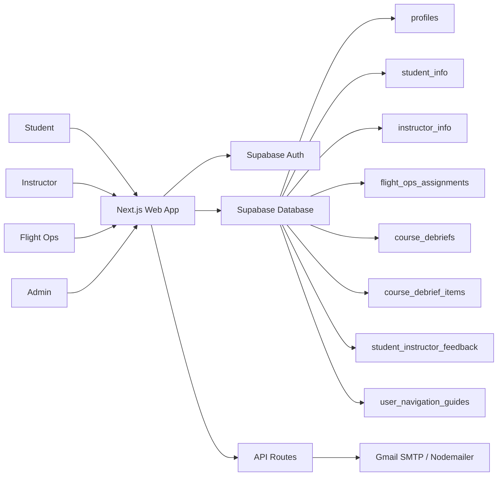
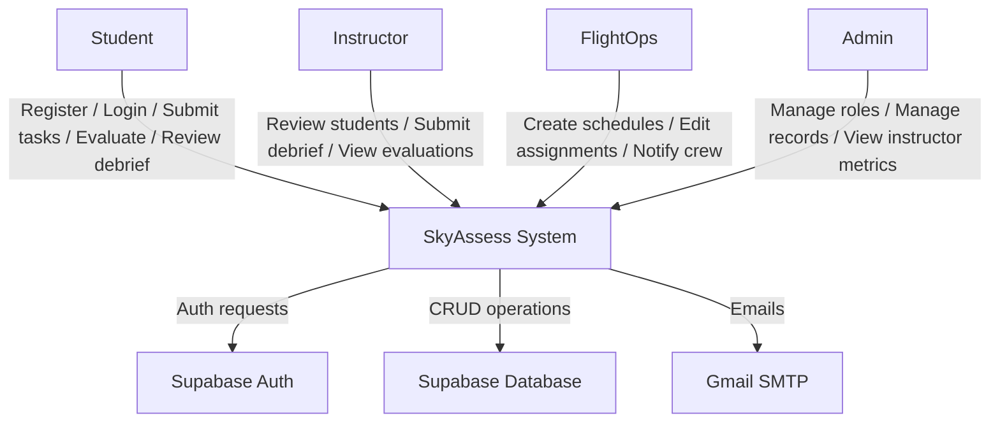
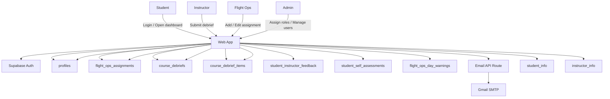
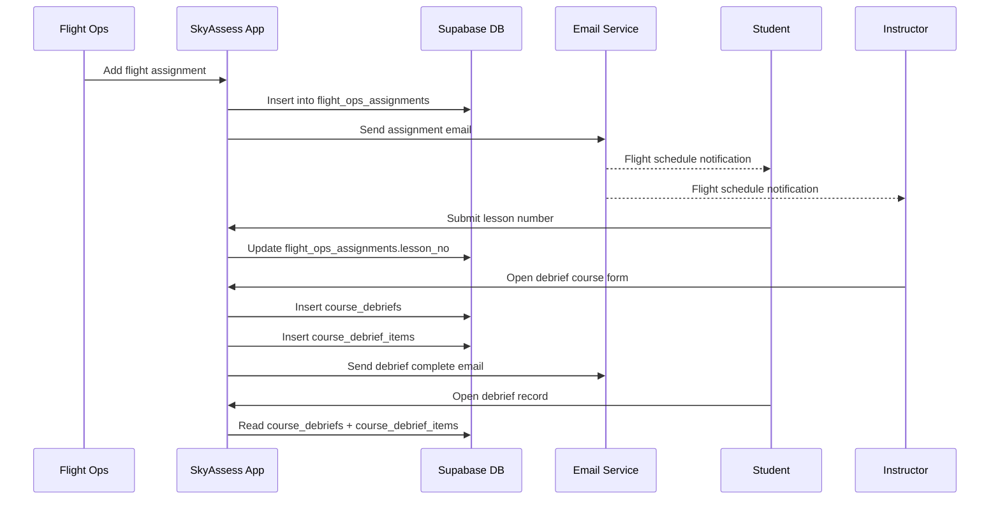
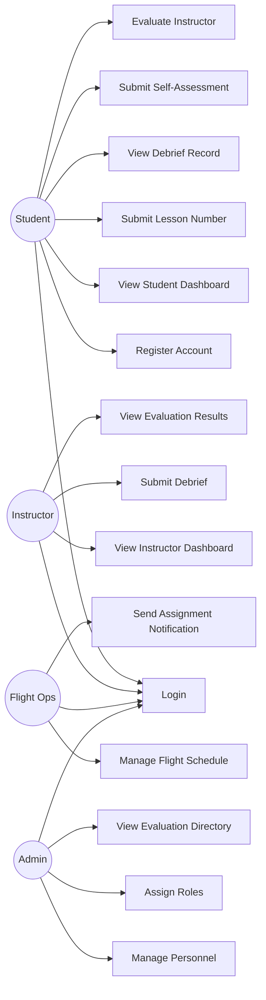

# SkyAssess Architecture and Flow

This document is the individual system-flow reference for SkyAssess. It covers:

- System Design
- Data Flow Diagram
- Use Case Diagram

The diagrams use Mermaid so they can be rendered in GitHub and Markdown viewers that support Mermaid.

## 1. System Design

SkyAssess is a role-based flight training platform built on:

- **Frontend:** Next.js 16 App Router
- **Backend Platform:** Supabase
- **Authentication:** Supabase Auth
- **Database:** Supabase PostgreSQL
- **Email Notifications:** Nodemailer + Gmail SMTP
- **Deployment:** Vercel

### 1.1 High-Level Architecture

### 1.2 Main Roles

- **Student**
  - Logs in
  - Views dashboard, tasks, performance, profile, debrief records
  - Submits lesson number
  - Evaluates instructors
  - Views completed debriefing

- **Instructor**
  - Views assigned students and schedule
  - Opens debriefing form
  - Submits PPL/CPL/IR/ME debrief records
  - Reviews evaluation feedback

- **Flight Ops**
  - Manages the flight calendar
  - Assigns student/instructor schedules
  - Edits unlocked schedules
  - Sends assignment notifications

- **Admin**
  - Manages personnel records
  - Assigns `admin` and `flightops` roles
  - Views instructor evaluation summaries

### 1.3 Core Tables

- `profiles`
  - identity, email, role, student/instructor IDs, flight hours
- `student_info`
  - student reference and student full name
- `instructor_info`
  - instructor reference and instructor full name
- `flight_ops_assignments`
  - daily aircraft schedule, student assignment, instructor assignment, lesson number
- `flight_ops_day_warnings`
  - aircraft maintenance / grounded state for a full day
- `course_debriefs`
  - master debrief record for PPL / CPL / IR / ME
- `course_debrief_items`
  - line-item grades and remarks per debrief
- `student_instructor_feedback`
  - anonymous student evaluation of instructors
- `student_self_assessments`
  - student self-rating for landings, takeoff, turns
- `user_navigation_guides`
  - stores guided-tour completion or skip state per page

## 2. Data Flow Diagram

### 2.1 Context-Level DFD

### 2.2 Level-1 DFD

### 2.3 Example Operational Flow: Flight Assignment to Debrief

## 3. Use Case Diagram

## 4. Role-Based Functional Flow

### 4.1 Student Flow

1. Student registers or logs in
2. Student opens dashboard
3. Student checks assigned flight schedule in `Tasks`
4. Student submits lesson number
5. Instructor completes debrief
6. Student receives debrief notification
7. Student reviews signed debrief record and PDF
8. Student submits self-assessment and instructor evaluation

### 4.2 Instructor Flow

1. Instructor logs in
2. Instructor views assigned students and today’s flights
3. Instructor waits for lesson number submission
4. Instructor opens course debrief form
5. Instructor grades items and signs
6. Debrief is saved to `course_debriefs` and `course_debrief_items`
7. Student is notified that debrief is completed

### 4.3 Flight Ops Flow

1. Flight Ops logs in to `/flight-ops`
2. Flight Ops selects date and aircraft row
3. Flight Ops creates or edits assignment if `lesson_no` is still null
4. System saves `flight_ops_assignments`
5. Optional email notification is sent to student and instructor
6. If aircraft is unavailable, Flight Ops adds whole-day warning

### 4.4 Admin Flow

1. Admin logs in
2. Admin manages student and instructor records
3. Admin assigns elevated roles (`admin`, `flightops`)
4. Admin opens evaluation directory
5. Admin reviews instructor-specific evaluation results

## 5. Design Notes

- IDs are normalized to lowercase in matching logic where applicable.
- Flight Ops editing is locked once `lesson_no` is filled.
- Student and instructor dashboards are role-restricted.
- Guided tours are stored per user and per page in `user_navigation_guides`.
- Shared debrief storage supports:
  - `PPL`
  - `CPL`
  - `IR`
  - `ME`

## 6. Recommended Diagram Usage

For documentation or defense, use:

- **System Design** for architecture explanation
- **Data Flow Diagram** for showing movement of data between users, app, and database
- **Use Case Diagram** for actor responsibilities and system scope

If needed, this file can be extended with:

- ER diagram
- deployment diagram
- sequence diagrams per module
- role-permission matrix
